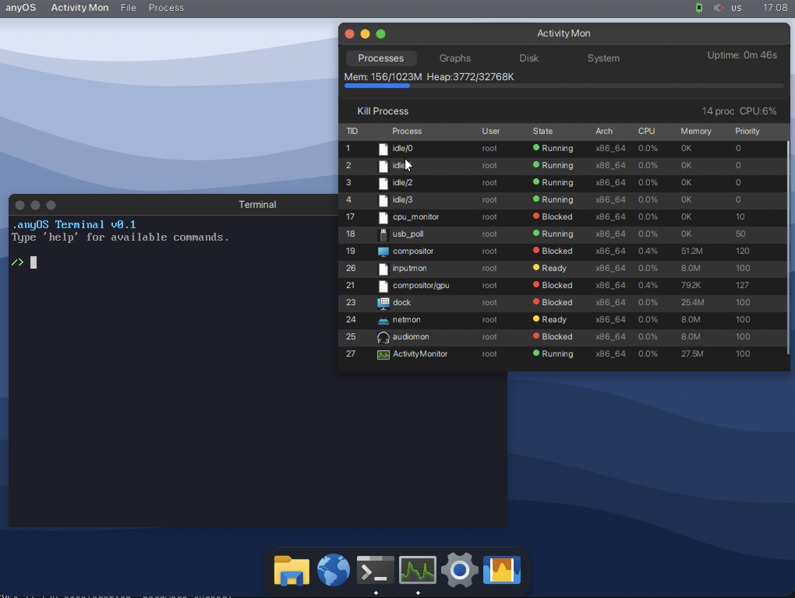
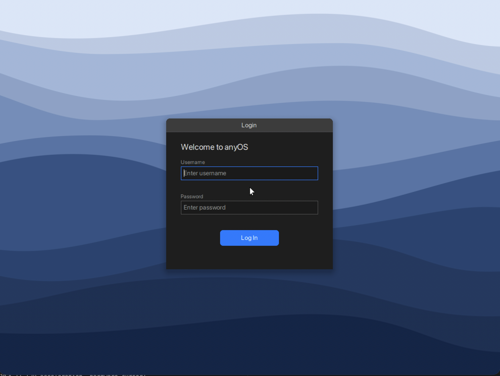
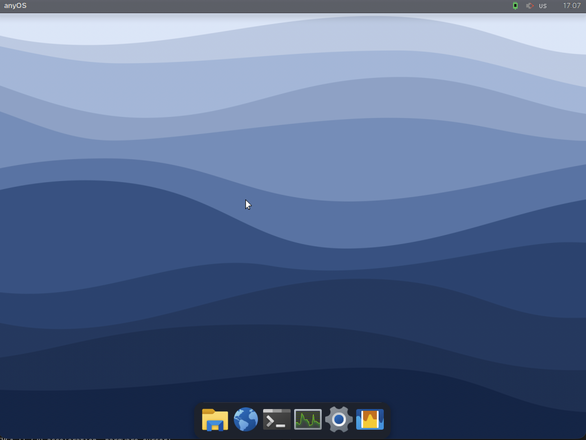
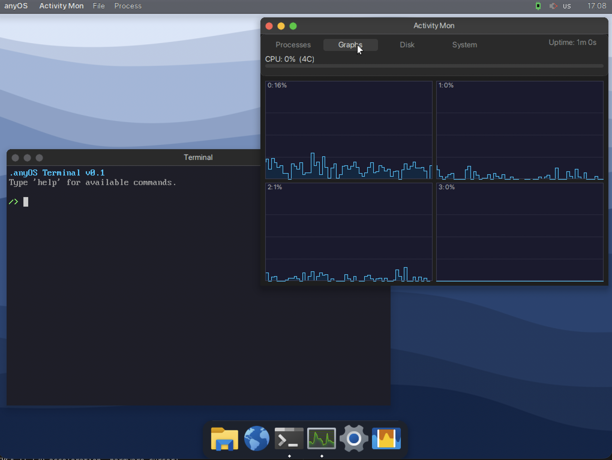
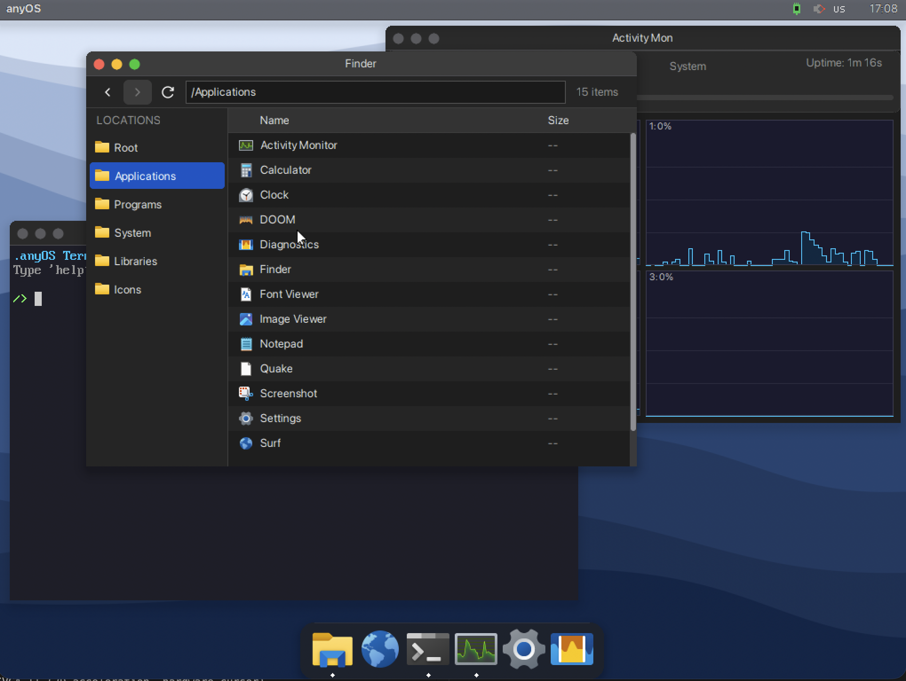
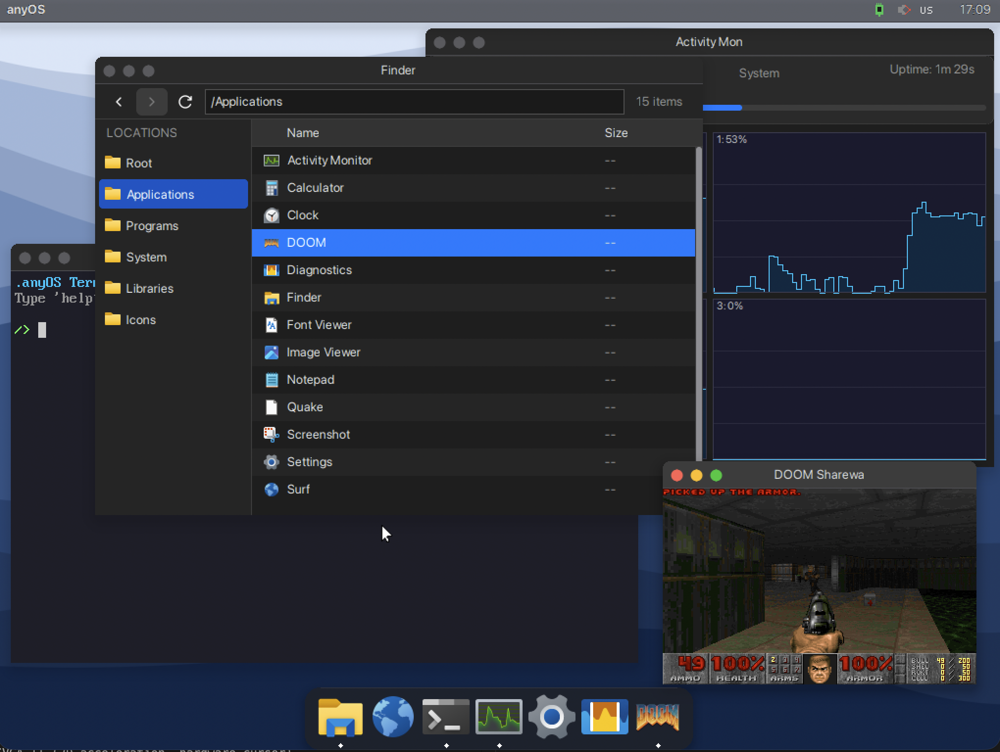
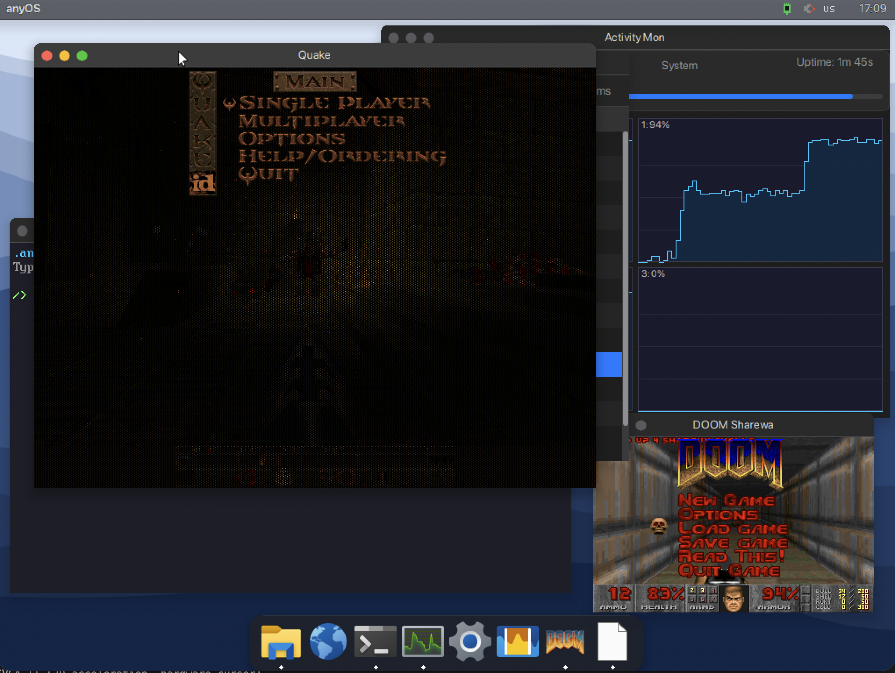

<div align="center">


<br><br>

**A 64-bit operating system built from scratch in Rust and Assembly**

macOS-inspired desktop with window compositor, network stack, USB support,<br>
audio playback, TrueType fonts, and an on-disk C compiler — all running bare-metal on x86_64.

<br>


<br>



<sub>Terminal and Activity Monitor running side by side on the anyOS desktop</sub>

<br><br>

[Features](#features) · [Screenshots](#screenshots) · [Quick Start](#quick-start) · [Documentation](#documentation) · [Contributing](#contributing)

</div>

<br>

> **A learning project** created purely for fun and curiosity. It demonstrates how operating systems work under the hood — from bootloader to desktop environment — all without relying on any existing OS or standard library. **Contributions are welcome!**

---

## Screenshots

<div align="center">
<table>
<tr>
<td align="center" width="50%">
<br>
<sub><b>Login Screen</b> — User authentication with wave wallpaper</sub>
</td>
<td align="center" width="50%">
<br>
<sub><b>Desktop</b> — Menu bar, dock, and dynamic wallpaper</sub>
</td>
</tr>
<tr>
<td align="center">
<br>
<sub><b>CPU Monitoring</b> — Real-time per-core graphs across 4 SMP cores</sub>
</td>
<td align="center">
<br>
<sub><b>Finder</b> — File browser with sidebar and icon view</sub>
</td>
</tr>
<tr>
<td align="center">
<br>
<sub><b>DOOM</b> — Running natively in a window</sub>
</td>
<td align="center">
<br>
<sub><b>Quake & DOOM</b> — Classic games running side by side</sub>
</td>
</tr>
</table>
</div>

---

## Features

### Kernel

- **64-bit x86_64** long mode with 4-level paging (4 KiB pages)
- **Preemptive multitasking** with priority-based round-robin scheduler (1 ms time slices)
- **SMP support** — multi-core via LAPIC/IOAPIC with per-CPU idle threads
- **Per-process address spaces** with isolated PML4 page directories
- **Ring 3 user mode** with dual syscall interface: `SYSCALL/SYSRET` (64-bit) and `INT 0x80` (32-bit compat)
- **113 system calls** across 21 categories (process, file I/O, networking, IPC, display, audio, USB, ...)
- **Physical + virtual memory manager** with kernel heap allocator
- **exFAT filesystem** with VFAT long filename support, symlinks, mount points, chmod/chown
- **Storage dispatch**: ATA PIO (legacy IDE) and **AHCI** (SATA DMA) backends
- **ELF loader** for user programs (ELF64 native + ELF32 compat)
- **FPU/SSE support** with eager save/restore (FXSAVE/FXRSTOR) per context switch
- **TSC-calibrated timekeeping** via PIT channel 2 polled (no IRQ dependency)
- **User identity system** — UID/GID, user accounts, groups, authentication

### Graphics & UI

- **VESA VBE** framebuffer (1024x768x32, runtime resolution switching)
- **Double-buffered compositor** with damage-based partial updates and blur effects
- **GPU drivers**: Bochs VGA (page flipping) and VMware SVGA II (2D acceleration, hardware cursor)
- **macOS-inspired dark theme** with rounded windows, shadows, and alpha blending
- **31 UI components** via the uisys shared library (buttons, text fields, sliders, tables, alerts, etc.)
- **5 shared libraries (DLLs)** — uisys, libimage, libfont, librender, libcompositor
- **TrueType font rendering** with subpixel LCD anti-aliasing (SF Pro family)

### Networking

- **Intel E1000** NIC driver (MMIO, DMA)
- **Protocol stack**: Ethernet, ARP, IPv4, ICMP, UDP, TCP, DHCP, DNS
- **TLS support** via BearSSL
- Userspace utilities: `ping`, `ifconfig`, `arp`, `dhcp`, `dns`, `wget`, `ftp`, `curl`

### USB

- **UHCI** (USB 1.1) and **EHCI** (USB 2.0) host controller drivers
- HID keyboard and mouse support
- Mass storage (bulk-only transport)

### Audio

- **AC'97** audio codec driver
- WAV/PCM playback via `play` command

### C Toolchain

- **TCC** (Tiny C Compiler) 0.9.27 running natively on the OS
- **NASM** 2.15+ assembler running natively
- **Minimal POSIX libc** (35 headers, stdio, stdlib, string, math, socket, etc.)
- Write, compile, and run C programs directly on anyOS: `cc hello.c -o hello && hello`

### Boot Methods

- **BIOS/MBR** — traditional PC boot (256 MiB disk, exFAT)
- **UEFI** — modern firmware boot (64 MiB GPT disk, exFAT, Rust UEFI bootloader)
- **ISO 9660** — CD-ROM/USB boot (El Torito, Rock Ridge extensions)

### User Programs

70+ command-line and GUI applications:

**GUI Applications (13):** Terminal, Finder, Settings, Activity Monitor, Notepad, Image Viewer, Video Player, Calculator, Clock, Screenshot, Diagnostics, Font Viewer, Surf (web browser prototype)

**Games (2):** DOOM (doomgeneric port), Quake (WinQuake software renderer port)

**CLI Utilities (69):**

| Category | Programs |
|----------|----------|
| File Management | `ls` `cat` `cp` `mv` `rm` `mkdir` `touch` `ln` `readlink` `find` `stat` `df` `mount` `umount` |
| Text Processing | `echo` `grep` `wc` `head` `tail` `sort` `uniq` `rev` `strings` `base64` |
| System Info | `sysinfo` `dmesg` `devlist` `ps` `free` `uptime` `uname` `hostname` `whoami` `which` `date` `cal` |
| Networking | `ping` `dhcp` `dns` `ifconfig` `arp` `wget` `ftp` `curl` |
| User Mgmt | `chmod` `chown` `su` `listuser` `listgroups` `adduser` `deluser` `addgroup` `delgroup` `passwd` |
| Shell | `env` `set` `export` `pwd` `clear` `sleep` `seq` `yes` `true` `false` |
| Binary/Hex | `hexdump` `xxd` |
| Multimedia | `play` `pipes` |
| Dev Tools | `cc` (TCC) `nasm` `git` `open` |

---

## Quick Start

```bash
# Clone the repository
git clone https://github.com/nicosommelier/anyos.git
cd anyos

# Set up the toolchain (installs cross-compiler)
./scripts/setup_toolchain.sh

# Build everything
mkdir -p build && cd build
cmake .. -G Ninja
ninja

# Run in QEMU
ninja run
```

### Prerequisites

<details>
<summary><b>macOS</b> (aarch64 or x86_64)</summary>

```bash
# Homebrew packages
brew install nasm qemu cmake ninja python3

# Rust nightly toolchain
rustup install nightly

# Python dependencies
pip install Pillow fonttools

# Cross-compiler for libc (run once)
./scripts/setup_toolchain.sh
```

</details>

<details>
<summary><b>Linux</b> (x86_64)</summary>

```bash
# Ubuntu/Debian
sudo apt install nasm qemu-system-x86 cmake ninja-build python3 python3-pip

# Rust nightly toolchain
rustup install nightly

# Python dependencies
pip install Pillow fonttools

# Cross-compiler for libc (run once)
./scripts/setup_toolchain.sh
```

</details>

<details>
<summary><b>Windows</b> (x86_64)</summary>

Requires MSYS2 or WSL for the cross-compiler. PowerShell build scripts are provided.

```powershell
# Install prerequisites via winget or manual download:
# - Rust nightly: https://rustup.rs
# - NASM: https://www.nasm.us
# - QEMU: https://www.qemu.org
# - CMake + Ninja: https://cmake.org
# - Python 3: https://python.org
# - i686-elf-gcc: run scripts/build_cross_compiler.ps1

pip install Pillow fonttools

# Set up toolchain
.\scripts\setup_toolchain.ps1
```

</details>

### Build Targets

<details>
<summary><b>All build and run targets</b></summary>

#### Disk Images

| Target | Description |
|--------|-------------|
| `ninja` | Build the complete OS (bootloader + kernel + programs + BIOS disk image) |
| `ninja uefi-image` | Build UEFI GPT disk image (64 MiB, exFAT) |
| `ninja iso` | Build ISO 9660 CD-ROM image (El Torito bootable) |

#### BIOS Boot

| Target | Description |
|--------|-------------|
| `ninja run` | Launch with Bochs VGA (software rendering) |
| `ninja run-vmware` | Launch with VMware SVGA II (2D acceleration, hardware cursor) |
| `ninja run-ahci` | Launch with AHCI (SATA DMA) + Bochs VGA |
| `ninja run-ahci-vmware` | Launch with AHCI + VMware SVGA II |
| `ninja run-audio` | Launch with AC'97 audio device |
| `ninja run-usb` | Launch with UHCI USB keyboard + mouse |
| `ninja run-usb-ehci` | Launch with EHCI USB 2.0 keyboard + mouse |
| `ninja debug` | Launch with GDB server on localhost:1234 |
| `ninja run-vmware-debug` | VMware SVGA + GDB server |

#### UEFI Boot

| Target | Description |
|--------|-------------|
| `ninja run-uefi` | OVMF UEFI firmware + VMware SVGA II |
| `ninja run-uefi-std` | OVMF UEFI firmware + Bochs VGA |

#### ISO Boot

| Target | Description |
|--------|-------------|
| `ninja run-cdrom` | Boot from ISO with VMware SVGA II |
| `ninja run-cdrom-std` | Boot from ISO with Bochs VGA |
| `ninja run-cdrom-with-disk` | Boot from ISO with HDD attached |

</details>

<details>
<summary><b>QEMU configuration</b></summary>

The default `run` target uses:
```
qemu-system-x86_64 -drive format=raw,file=anyos.img -m 1024M -smp cpus=4 \
  -serial stdio -vga std -netdev user,id=net0 -device e1000,netdev=net0 \
  -no-reboot -no-shutdown
```

Key flags:
- `-vga std` — Bochs VGA (VESA + page flipping)
- `-vga vmware` — VMware SVGA II (2D acceleration + hardware cursor)
- `-serial stdio` — Kernel serial output to terminal
- `-m 1024M` — 1 GiB RAM
- `-smp cpus=4` — 4 CPU cores

For AHCI (SATA DMA) disk I/O instead of legacy ATA PIO:
```
-drive id=hd0,if=none,format=raw,file=anyos.img \
  -device ich9-ahci,id=ahci -device ide-hd,drive=hd0,bus=ahci.0
```

Or use `./scripts/run.sh --ahci [--vmware | --std]` for quick testing.

</details>

---

## Project Structure

<details>
<summary><b>Full directory tree</b></summary>

```
anyos/
  bootloader/            Bootloader sources
    stage1/                MBR boot sector (512 bytes, NASM)
    stage2/                Protected mode setup, VESA VBE, kernel loading (NASM)
    uefi/                  UEFI bootloader (Rust, x86_64-unknown-uefi)
  kernel/                Kernel source (Rust + ASM)
    asm/                   Context switch, ISR/IRQ stubs, syscall entry, SMP trampoline
    src/
      arch/x86/            GDT, IDT, APIC, PIT, TSC, paging, CPUID
      drivers/             PCI, GPU (Bochs/VMware), keyboard, mouse, E1000, ATA, AHCI,
                           serial, AC'97 audio, UHCI, EHCI
      fs/                  VFS, exFAT, FAT16, devfs
      graphics/            Framebuffer management
      ipc/                 Pipes, event bus, shared memory
      memory/              Physical allocator, virtual memory, heap
      net/                 Ethernet, ARP, IPv4, ICMP, UDP, TCP, DHCP, DNS
      sync/                Spinlock, mutex
      syscall/             113 syscall handlers
      task/                Scheduler, context switch, ELF loader, DLL loader
      crypto/              MD5 hash
  libs/                  Libraries
    stdlib/                anyos_std — Rust standard library for user programs
    libc/                  POSIX C library (35 headers, i686-elf-gcc)
    uisys/                 uisys.dlib — UI component DLL (31 components, 84 exports)
    uisys_client/          Client stub crate for uisys
    libimage/              libimage.dlib — Image decoding DLL (PNG, BMP, JPEG, ICO, MJV)
    libimage_client/       Client stub crate for libimage
    libfont/               libfont.dlib — TrueType font rendering DLL
    libfont_client/        Client stub crate for libfont
    librender/             librender.dlib — 2D graphics primitives DLL
    librender_client/      Client stub crate for librender
    libcompositor/         libcompositor.dlib — Compositor client API DLL
    libcompositor_client/  Client stub crate for libcompositor
  bin/                   CLI program sources (69 Rust programs)
  apps/                  GUI application sources (13 .app bundles)
  system/                System programs
    init/                  Init system (PID 1)
    login/                 Login manager
    audiomon/              Audio monitor daemon
    netmon/                Network monitor daemon
    inputmon/              Input event monitor
    compositor/            Window compositor + dock
    terminal/              Terminal emulator
    finder/                File browser
    settings/              System preferences
    taskmanager/           Activity Monitor
  third_party/           External dependencies
    tcc-0.9.27/            Tiny C Compiler
    nasm/                  NASM assembler
    doom/                  doomgeneric port
    quake/                 WinQuake port
    curl/                  curl HTTP client
    bearssl/               BearSSL TLS library
    libgit2/               Git library
    minigit/               Mini git CLI
  tools/                 Build utilities (Python)
    mkimage.py             Disk image builder (MBR/UEFI/ISO)
    elf2bin.py             ELF to flat binary converter
    gen_font.py            Bitmap font generator
    encode_mjv.py          MJV video encoder
  scripts/               Build, run, debug scripts (.sh + .ps1)
  sysroot/               Disk filesystem template
  docs/                  API documentation
```

</details>

### DLL Architecture

anyOS uses a custom **DLIB** (Dynamic Library) format for shared libraries. Each DLL is loaded at a fixed virtual address and exports a `#[repr(C)]` function pointer table prefixed with a `DLIB` magic header.

| DLL | Base Address | Exports | Purpose |
|-----|-------------|---------|---------|
| uisys | `0x04000000` | 84 | UI components (buttons, sliders, tables, text fields, ...) |
| libimage | `0x04100000` | 7 | Image decoding (PNG, BMP, JPEG, ICO) and scaling |
| libfont | `0x04200000` | 7 | TrueType font rasterization with LCD subpixel rendering |
| librender | `0x04300000` | 18 | 2D drawing primitives (lines, rects, circles, gradients) |
| libcompositor | `0x04380000` | 16 | Window creation, event handling, IPC with compositor |

Programs link against lightweight client stub crates (e.g. `uisys_client`, `libfont_client`) that read the export table from the DLL's fixed address at runtime.

---

## Documentation

- **[Architecture Overview](docs/architecture.md)** — Boot process, memory layout, scheduling, IPC, USB, user identity
- **[Syscall Reference](docs/syscalls.md)** — Complete reference for all 113 system calls
- **[Standard Library API](docs/stdlib-api.md)** — `anyos_std` crate reference for Rust user programs
- **[UI System API](docs/uisys-api.md)** — `uisys` DLL component reference (31 components, 84 exports)
- **[C Library API](docs/libc-api.md)** — POSIX libc reference (35 headers) for C programs
- **[libimage API](docs/libimage-api.md)** — Image decoding, scaling, ICO, and video (MJV)
- **[libfont API](docs/libfont-api.md)** — TrueType font rendering with subpixel LCD anti-aliasing
- **[librender API](docs/librender-api.md)** — 2D graphics primitives (fill, stroke, gradient, AA)
- **[libcompositor API](docs/libcompositor-api.md)** — Window management and compositor IPC

---

## Developing User Programs

### Rust Programs

User programs use the `anyos_std` crate and are structured as `#![no_std]` binaries:

```rust
#![no_std]
#![no_main]

anyos_std::entry!(main);

fn main() {
    anyos_std::println!("Hello from anyOS!");
}
```

Each program needs:
1. `Cargo.toml` depending on `anyos_std`
2. `build.rs` that sets the linker script (`-T stdlib/link.ld`)
3. Entry in root `Cargo.toml` exclude list
4. Entry in `CMakeLists.txt` via `add_rust_user_program()`

See [stdlib API docs](docs/stdlib-api.md) for the full syscall and library reference.

### GUI Programs

GUI programs use the `uisys_client` crate for macOS-style UI components:

```rust
#![no_std]
#![no_main]

use anyos_std::*;
use uisys_client::*;

anyos_std::entry!(main);

fn main() {
    let win = ui::window::create("My App", 100, 100, 400, 300);

    let mut btn = button::UiButton::new(20, 20, 120, 32, types::ButtonStyle::Primary);
    let mut event = [0u32; 5];

    loop {
        if ui::window::get_event(win, &mut event) == 1 {
            let ev = types::UiEvent::from_raw(&event);
            if ev.event_type == 0 { break; } // window closed
            if btn.handle_event(&ev) {
                println!("Button clicked!");
            }
        }
        btn.render(win, "Click Me");
        ui::window::present(win);
        process::yield_cpu();
    }
}
```

See [uisys API docs](docs/uisys-api.md) for all 31 UI components.

### C Programs

Write C programs and compile them directly on the OS:

```bash
# In the anyOS terminal:
cc hello.c -o hello
hello
```

The on-disk TCC compiler supports standard C with the bundled libc. See [libc API docs](docs/libc-api.md) for the full header reference.

---

## Contributing

This is a community project and contributions are welcome! Here's how to get started:

1. **Fork** the repository
2. **Create a branch** for your feature or fix
3. **Build and test** with `ninja run`
4. **Submit a pull request** with a clear description

Areas where help is appreciated:
- Bug fixes and stability improvements
- New user programs and utilities
- UI component improvements
- Filesystem enhancements (FAT32, ext2)
- Network protocol improvements (full TCP, HTTPS)
- Documentation and tutorials
- Testing on different QEMU versions and configurations

### Code Style

- Rust: standard `rustfmt` formatting
- Assembly: NASM syntax with clear comments
- All source files include a copyright header (run `scripts/add_copyright.sh` to add)

---

## License

This project is licensed under the MIT License — see [LICENSE](LICENSE) for details.

## Contact

**Christian Moeller** — [c.moeller.ffo@gmail.com](mailto:c.moeller.ffo@gmail.com) · [brianmayclone@googlemail.com](mailto:brianmayclone@googlemail.com)

---

<div align="center">
<sub>Built with curiosity and a lot of coffee. If you're learning OS development, I hope this codebase helps you on your journey.</sub>
</div>
