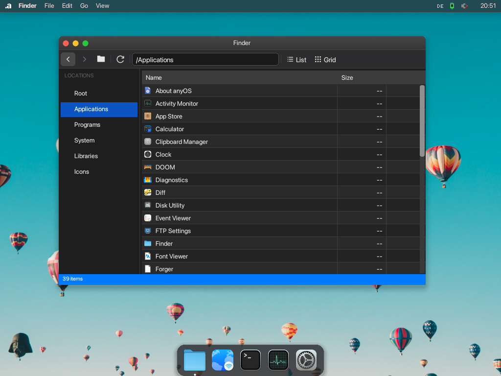
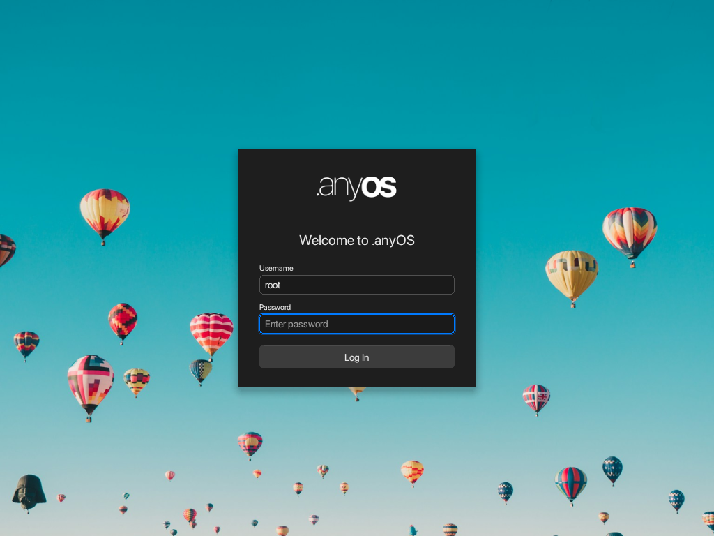
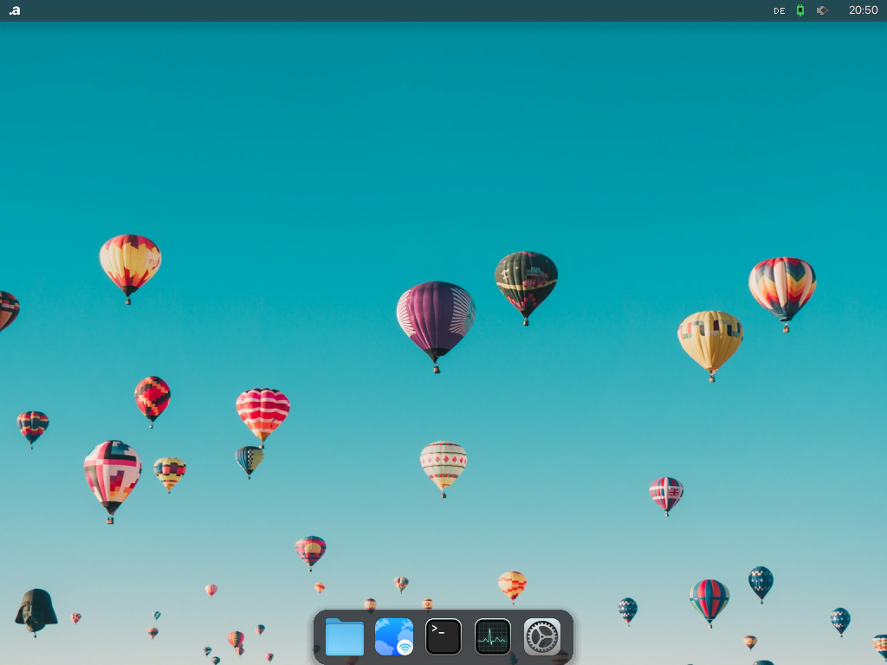
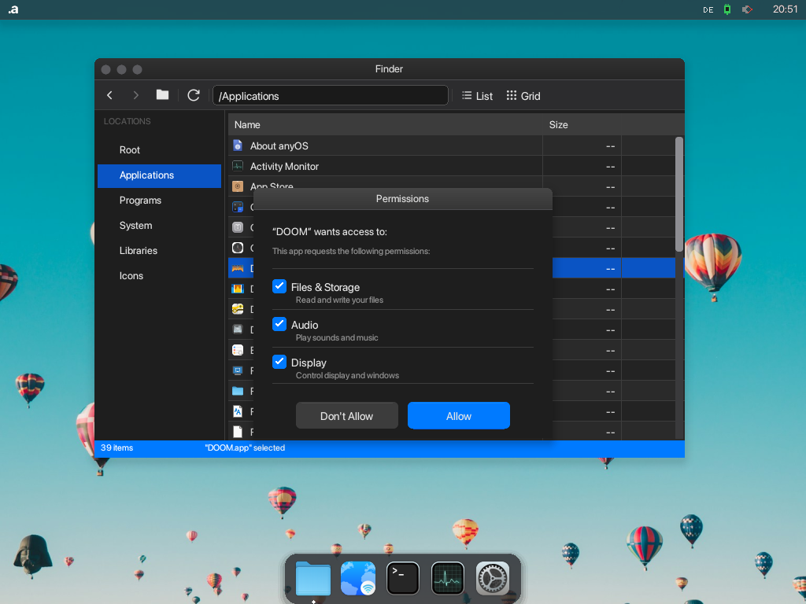
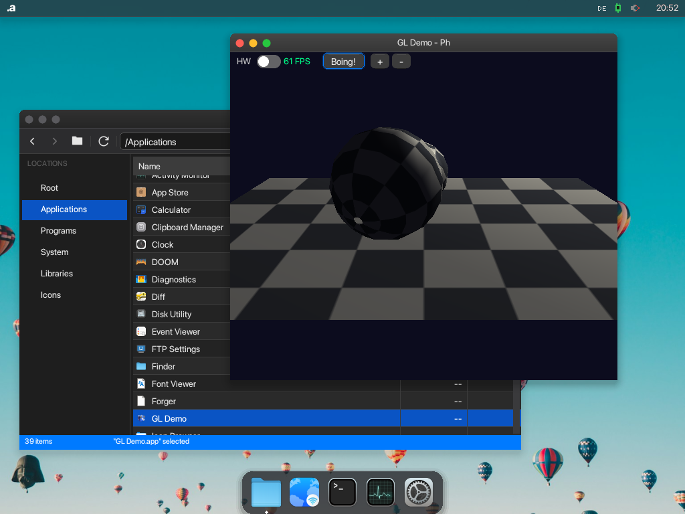
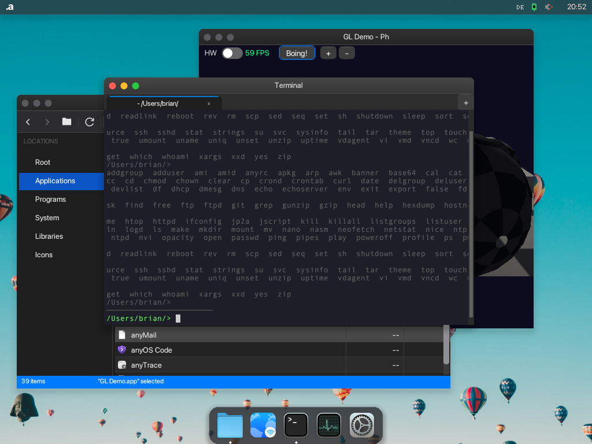
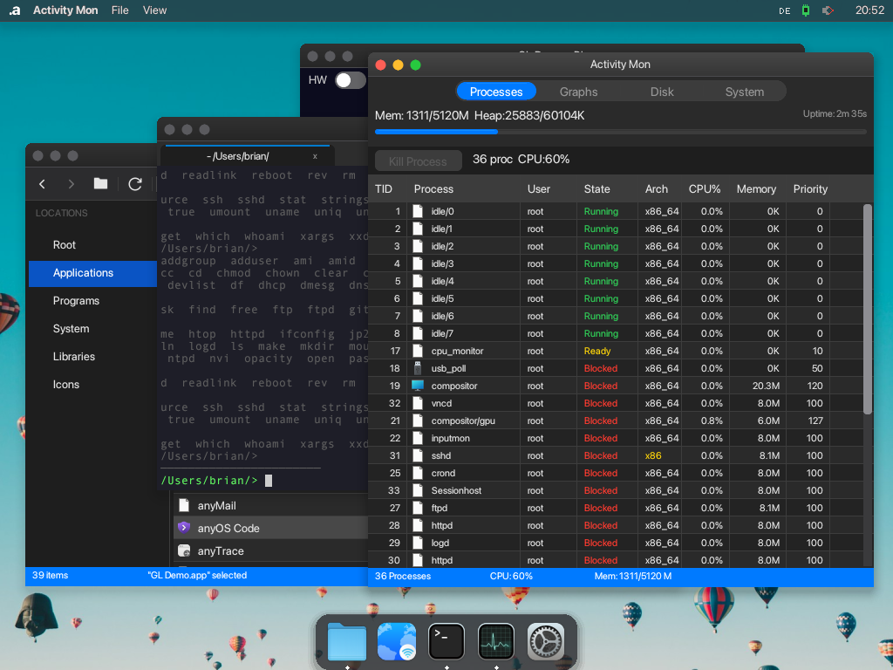
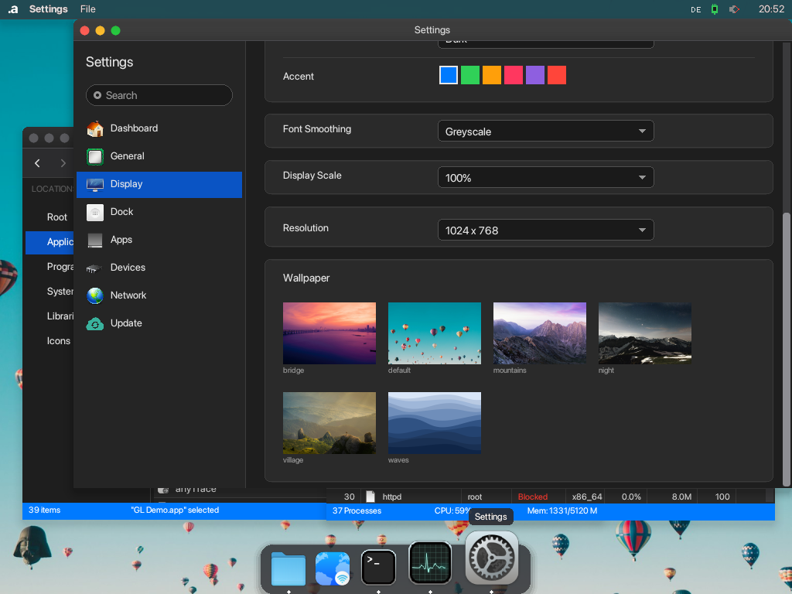
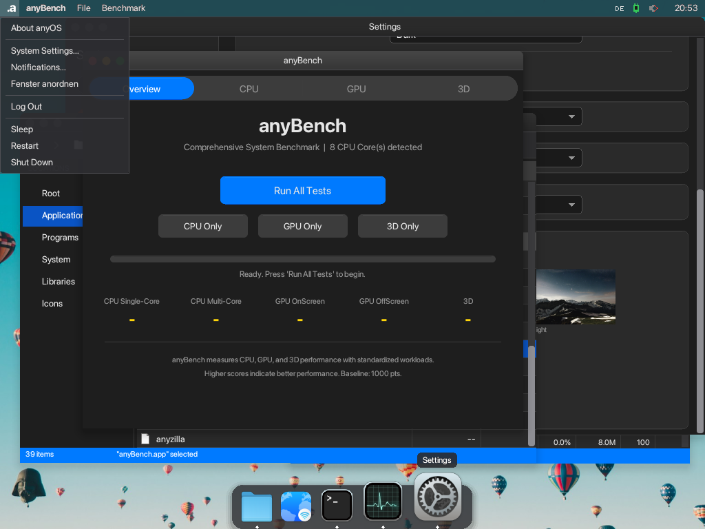

<div align="center">


<br><br>

**A 64-bit operating system built from scratch in Rust and Assembly**

macOS-inspired desktop with window compositor, OpenGL ES 2.0 (hardware-accelerated via VirGL/SVGA3D),<br>
full network stack, USB 3.0, 7 filesystems, audio, TrueType fonts, a built-in x86 VM,<br>
and a self-hosted Rust compiler — all running bare-metal on x86_64.

<br>


<br>



<sub>Finder browsing the Applications folder on the anyOS desktop</sub>

<br><br>

[Features](#features) · [Screenshots](#screenshots) · [Quick Start](#quick-start) · [Documentation](#documentation) · [Contributing](#contributing)

</div>

<br>

> **A learning project** created purely for fun and curiosity. It demonstrates how operating systems work under the hood — from bootloader to desktop environment — all without relying on any existing OS or standard library. **Contributions are welcome!**

---

## Screenshots

<div align="center">
<table>
<tr>
<td align="center" width="50%">
<br>
<sub><b>Login Screen</b> — User authentication with balloon wallpaper</sub>
</td>
<td align="center" width="50%">
<br>
<sub><b>Desktop</b> — Menu bar, dock, and wallpaper</sub>
</td>
</tr>
<tr>
<td align="center">
<br>
<sub><b>Finder</b> — File browser with sidebar and application list</sub>
</td>
<td align="center">
<br>
<sub><b>Permissions</b> — Runtime app permission dialog</sub>
</td>
</tr>
<tr>
<td align="center">
<br>
<sub><b>GL Demo</b> — OpenGL ES 2.0 physics demo with reflections</sub>
</td>
<td align="center">
<br>
<sub><b>Terminal & 3D</b> — Terminal and GL Demo running side by side</sub>
</td>
</tr>
<tr>
<td align="center">
<br>
<sub><b>Activity Monitor</b> — Real-time CPU graphs and process list</sub>
</td>
<td align="center">
<br>
<sub><b>Settings</b> — Display, accent colors, and wallpaper selection</sub>
</td>
</tr>
<tr>
<td align="center" colspan="2">
<br>
<sub><b>anyBench</b> — System benchmark with Apple-style menu bar</sub>
</td>
</tr>
</table>
</div>

---

## Features

### Kernel

- **Mach-style microkernel architecture** with message-based IPC
- **64-bit x86_64** long mode with 4-level paging (4 KiB pages)
- **Preemptive multitasking** with Mach-style multi-level priority scheduler (128 levels, bitmap-indexed O(1) thread selection, per-CPU run queues)
- **SMP support** — multi-core (up to 16 CPUs) via LAPIC/IOAPIC with per-CPU idle threads and work stealing
- **Per-process address spaces** with isolated PML4 page directories
- **Ring 3 user mode** with dual syscall interface: `SYSCALL/SYSRET` (64-bit) and `INT 0x80` (32-bit compat)
- **232 system calls** across 22 categories (process, file I/O, networking, IPC, display, audio, USB, permissions, signals, debugging, hardware virtualization, ...)
- **Physical + virtual memory manager** with kernel heap allocator
- **7 filesystems**: exFAT (primary, with symlinks, mount points, chmod/chown), FAT12/16/32, NTFS (read-only), ISO 9660 (Rock Ridge), OverlayFS, SMB/CIFS, devfs
- **Storage drivers**: ATA PIO, **AHCI** (SATA DMA), **NVMe** (PCIe), ATAPI (CD-ROM), **SDHCI** (SD/SDHC/SDXC cards), LSI SCSI
- **ELF loader** for user programs (ELF64 native + ELF32 compat)
- **Loadable kernel drivers** (KDRV format) with PCI device matching and hot-loading from `.ddv` bundles
- **FPU/SSE support** with lazy save/restore (CR0.TS flag) per context switch
- **TSC-calibrated timekeeping** via PIT channel 2 polled (no IRQ dependency)
- **POSIX compatibility**: `fork`, `exec`, `pipe`, `dup2`, `signals` (13 signals: SIGHUP–SIGTTOU, job control with SIGTSTP/SIGCONT), `poll()` for pipes and files
- **Security hardening**: NX-bit / DEP (EFER.NXE + per-segment ELF page flags), ASLR (stack + mmap randomization via RDRAND/TSC), up to 256 FDs per process with separated socket namespace
- **User identity system** — UID/GID, user accounts, groups, authentication
- **Runtime app permissions** — per-user capability grants with consent dialog on first launch, reviewable in Settings
- **Thermal monitoring** — Intel/AMD CPU temperature sensors and LM75/TMP75 external sensors via SMBus
- **I2C/SMBus support** — device detection, byte/word/block read/write for touchpads, sensors, and other I2C peripherals

### Graphics & UI

- **VESA VBE** framebuffer (1024x768x32, runtime resolution switching up to 1920x1080)
- **Double-buffered compositor** with damage-based partial updates and blur effects
- **7 GPU drivers** with automatic PCI detection:
  - **Bochs VGA** (page flipping, VESA modes)
  - **VMware SVGA II** (2D acceleration, hardware cursor, 3D via SVGA3D)
  - **VirtualBox VGA** (VBoxVGA and VBoxSVGA auto-detection)
  - **VirtIO GPU** (2D + virgl 3D acceleration via `VIRTIO_GPU_CMD_SUBMIT_3D`)
  - **Intel HD/Iris/UHD/Xe** framebuffer (Gen 5+, reads pre-configured display pipe from UEFI GOP)
  - **AMD Radeon** framebuffer (HD 5000+, RX 400/500, RX 5000–7000 Navi/RDNA)
  - **NVIDIA GeForce** framebuffer (Kepler 600+ through Ada RTX 4000)
- **macOS-inspired dark theme** with rounded windows, shadows, and alpha blending
- **44 UI controls** via the anyui framework (buttons, text fields, code editor, tree view, data grid, toolbars, canvas, expander, flow/stack panels, autocomplete, etc.)
- **14 shared libraries** — libimage, librender, libcompositor (DLIB format) + libanyui, libfont, libgl, libcorevm, libhttp, libdb, libzip, libsvg, libjs, libwebview, libm (.so format with ELF dynamic linking)
- **TrueType font rendering** with gamma-corrected subpixel LCD anti-aliasing and size-adaptive smoothing (SF Pro family)

### 3D Graphics

- **OpenGL ES 2.0** compatible 3D engine (`libgl.so`) with 105 API exports
- **Hardware-accelerated 3D** via loadable userspace GPU drivers (`.drv` shared libraries):
  - **VMware SVGA3D** (`svga3d.drv`) — DX9 Shader Model 2.0 bytecode, FIFO command submission
  - **VirtIO GPU / virgl** (`virgl.drv`) — Gallium3D/TGSI command buffers via `VIRTIO_GPU_CMD_SUBMIT_3D`
  - Automatic fallback to software rasterizer when no `.drv` is available
- **Built-in GLSL ES 1.00 shader compiler** — lexer, recursive-descent parser, AST, SSA-style IR (~35 opcodes), register-based interpreter
- **Software rasterizer** — edge-function triangle fill, Sutherland-Hodgman frustum clipping, perspective-correct varying interpolation, per-fragment depth test and blending
- **No libm dependency** — all transcendental math (sin, cos, sqrt, pow, log2, exp2) via polynomial approximations
- **Vertex + Fragment shaders** with swizzle, type constructors (vec2/3/4, mat3/4), 18 built-in functions (texture2D, normalize, dot, cross, clamp, mix, reflect, ...)
- **Texture sampling** with nearest/bilinear filtering and repeat/clamp/mirror wrap modes
- **Physics engine** — rigid body dynamics with sphere/plane/box colliders, gravity, restitution, forces, impulses, angular velocity (20 API exports)

### Networking

- **5 NIC drivers** with automatic PCI detection:
  - **Intel E1000** (82540EM/82545EM, MMIO, DMA)
  - **Intel IGC** (I225/I226/I210/I211 Gigabit Ethernet)
  - **Realtek RTL8125** (2.5 Gbps Ethernet, common on gaming boards)
  - **Realtek RTL8168** (Gigabit Ethernet, most common consumer NIC)
  - **VirtIO Net** (QEMU/KVM, transitional + modern)
- **WiFi**: Realtek RTL8188EU USB WiFi adapter support
- **Protocol stack**: Ethernet, ARP, IPv4, ICMP, UDP, TCP, DHCP, DNS
- **Loopback interface** (`lo` 127.0.0.1) with own-IP loopback routing
- **TLS support** via BearSSL
- **FTP server** (`ftpd`) with PASV/EPSV, user shares, anonymous access, MLSD/FEAT/SIZE/MDTM
- **SSH server/client** (`sshd`/`ssh`/`scp`)
- **HTTP server** (`httpd`)
- **NTP time synchronization** (`ntp`/`ntpd`)
- Userspace utilities: `ping`, `ifconfig`, `arp`, `dhcp`, `dns`, `wget`, `ftp`, `curl`, `netstat`, `wifi`

### USB

- **UHCI** (USB 1.1), **EHCI** (USB 2.0), and **xHCI** (USB 3.0) host controller drivers
- HID keyboard, mouse, and digitizer (touch) support
- Mass storage (bulk-only transport) for USB flash drives
- CDC ACM (serial devices) and CDC ECM (USB Ethernet adapters)
- USB Audio devices
- USB Hub enumeration and port management

### Audio

- **AC'97** codec driver and **Intel HDA** (High Definition Audio) driver
- WAV/PCM playback via `play` command

### Input

- **PS/2** keyboard and mouse
- **I2C-HID** touchpad and touchscreen support
- **USB HID** keyboard, mouse, and digitizer via UHCI/EHCI/xHCI
- **5 keyboard layouts**: US, German, French, Swiss, Polish
- **VMware vmmouse** and **VirtualBox absolute mouse** for seamless pointer integration

### Hypervisor Integration

- **VirtualBox**: VMMDev guest integration (absolute mouse, host events, capability negotiation)
- **VMware**: vmmouse absolute mouse input, SVGA II 2D acceleration, SVGA3D hardware 3D
- **QEMU/KVM**: Bochs VGA, E1000, AC'97/HDA, AHCI, NVMe, VirtIO (GPU, Net, RNG, Balloon, Serial)

### CoreVM — Built-in Virtual Machine

anyOS includes **CoreVM**, a pure-software x86 virtual machine built entirely in Rust and NASM assembly, running in userspace. No hardware virtualization (VT-x/AMD-V) required — every instruction is decoded and executed in software.

- **Full x86 ISA** — 16-bit real mode, 32-bit protected mode, 64-bit long mode
- **Complete PC hardware emulation** — dual 8259A PIC, 8254 PIT, PS/2 keyboard/mouse, CMOS RTC, 16550 UART, VGA/SVGA framebuffer, ATA/IDE disk controller, Intel E1000 NIC, PCI bus
- **Built-in BIOS** — custom 64 KB NASM BIOS with INT 10h/13h/15h/16h/19h/1Ah services, El Torito CD boot; SeaBIOS also supported
- **JIT compiler** — two-phase acceleration: decode cache for hot basic blocks + native x86-64 code compilation
- **Paging support** — 2-level (32-bit), PAE (3-level), and 4-level (long mode) page table walks with NX, WP, U/S enforcement
- **VM Manager GUI** — create, configure, and run VMs with live VGA display, settings dialog, and disk image creation
- **58 C ABI exports** via `libcorevm.so` + typed Rust client wrapper (`libcorevm_client`)

See **[CoreVM API Reference](docs/corevm-api.md)** for the complete documentation.

### anyrc — Self-Hosted Rust Compiler

- **anyrc** — native Rust subset compiler running on anyOS itself
- Custom x86_64 machine code backend (no LLVM/Cranelift dependency)
- Full compiler pipeline: Lexer → Parser → HIR → MIR → Borrow Checker → Codegen → ELF
- Supports structs, enums, generics, traits, closures, `unsafe`, inline assembly, modules
- NLL-style borrow checker and Hindley-Milner type inference
- Goal: self-hosting (anyrc compiles itself and the anyOS kernel on anyOS)

See **[anyrc Documentation](docs/anyrc-api.md)** for the full reference.

### C Toolchain & Shell

- **TCC** (Tiny C Compiler) 0.9.27 running natively on the OS
- **NASM** 2.15+ assembler running natively
- **dash** (Debian Almquist Shell) — POSIX-compliant shell
- **Minimal POSIX libc** (35 headers, stdio, stdlib, string, math, socket, etc.)
- Write, compile, and run C programs directly on anyOS: `cc hello.c -o hello && hello`

### Build System Tools

Four native C99 tools replace all Python build scripts. They compile at the start of each build and are also available as source on the disk for self-hosting:

| Tool | Purpose | Key Features |
|------|---------|--------------|
| **anyelf** | ELF conversion | `bin` (flat binary), `dlib` (DLIB v3 shared library), `kdrv` (kernel driver) |
| **mkimage** | Disk image creation | BIOS (MBR + exFAT), UEFI (GPT + ESP + exFAT), ISO (El Torito + ISO 9660); **incremental updates** (use `--reset` for full rebuild) |
| **anyld** | ELF64 linker | Links `.o` + `.a` into shared objects (ET_DYN with .dynsym/.hash/.dynamic) |
| **mkappbundle** | App bundle creator | Validates Info.conf, capabilities, icon (ICO), executable; assembles `.app` directory structure |

All tools support `ONE_SOURCE` single-file compilation for TCC compatibility, enabling self-hosted builds directly on anyOS.

### Bootloader

- **BIOS/MBR** — configurable two-stage bootloader:
  - **Graphical splash screen** with logo display (2x upscaled, transparency)
  - **Interactive boot menu** with keyboard navigation (Up/Down + Enter)
  - **INI-style `boot.cfg`** with up to 8 boot entries, configurable timeout, default entry
  - **Kernel parameters**: `verbose` (debug logging), `nogui` (text console), `custom` (interactive input)
  - **Chainloading** — boot other operating systems from any disk/partition
  - **A20 line** enable via 3 methods (BIOS, keyboard controller, port 0x92)
  - **VESA VBE** graphics mode setup with fallback chain (1024x768 → 800x600 → 640x480)
  - **exFAT reader** in the bootloader for HDD boot path
  - Editable from the running OS via `bcedit` tool
- **UEFI** — modern firmware boot via Rust EFI application (64 MiB GPT disk, exFAT)
- **ISO 9660** — CD-ROM/USB boot (El Torito, Rock Ridge extensions, OverlayFS for writable root)

### Installer

- **Full disk installer** — when booting from ISO, anyOS can be installed to a hard drive:
  - MBR partition table creation with bootable exFAT partition
  - Stage 1 + Stage 2 bootloader installation to disk
  - exFAT filesystem formatting (FAT32 allocation tables, bitmap, upcase table)
  - Recursive system file copy (`/System`, `/Applications`, `/Users`, `/boot`, `/media`)
  - Case-fixing for exFAT compatibility
  - Safety confirmation prompt before erasing disk
  - Disk listing via `install -l` to enumerate available block devices

### User Programs

177+ command-line and GUI applications:

**GUI Applications (33):** anyOS Code (IDE), anyMail (email client), anyZilla (FTP client), App Store, Benchmark, Calculator, Clipboard Manager, Clock, Diagnostics, Diff/Merge (Meld-like), Font Viewer, Forger (3D voxel world), FTP Settings, GL Demo (3D physics), Icon Viewer, Image Viewer, **Installer**, Keyboard, Markdown Viewer, Minesweeper, Notepad, Notifications, Paint, **Runner**, Screenshot, Surf (web browser), **Updater**, Video Player, **VM Manager** (virtual machine), VNC Settings, Web Manager, anyui Demo, Button Demo

**System Services (22):** Init, Login, Compositor, Terminal, Finder, Settings, Activity Monitor, Permission Dialog, Shell (dash), Audio Monitor, Network Monitor, Input Monitor, Event Viewer, Disk Utility, amid (statistics daemon), notifyd (notifications), anybout (about), anytrace (tracing), crashdialog, desktopd, sessionhost, textmode_console

**Games (2):** DOOM (doomgeneric port), Quake (WinQuake software renderer port)

**CLI Utilities (122):**

| Category | Programs |
|----------|----------|
| File Management | `ls` `cat` `cp` `mv` `rm` `mkdir` `touch` `ln` `readlink` `find` `stat` `df` `mount` `umount` `fdisk` `zip` `unzip` `tar` `gzip` `file` `sdel` |
| Text Processing | `echo` `grep` `sed` `awk` `wc` `head` `tail` `sort` `uniq` `rev` `strings` `base64` `xargs` `banner` |
| System Info | `sysinfo` `dmesg` `devlist` `ps` `top` `htop` `free` `uptime` `uname` `hostname` `whoami` `which` `date` `cal` `neofetch` `mode` |
| Networking | `ping` `dhcp` `dns` `ifconfig` `arp` `wget` `ftp` `ftpd` `curl` `netstat` `echoserver` `httpd` `ssh` `sshd` `scp` `vncd` `wifi` `ntp` `ntpd` |
| User Mgmt | `chmod` `chown` `su` `sudo` `listuser` `listgroups` `adduser` `deluser` `addgroup` `delgroup` `passwd` |
| Shell & Process | `env` `set` `export` `pwd` `clear` `sleep` `seq` `yes` `true` `false` `nice` `kill` `killall` `reboot` |
| Shell Builtins | `alias` `unalias` `eval` (via dash) |
| System Admin | `svc` `logd` `crond` `crontab` `ami` `apkg` `sync` `bcedit` `install` |
| Settings Store | `sget` `sstore` `sdel` `ac` |
| Binary/Hex | `hexdump` `xxd` |
| Multimedia | `play` `pipes` `jp2a` |
| Dev Tools | `cc` (TCC) `nasm` `make` `git` `anyrc` `open` `vi` `nvi` `nano` `jscript` |
| VM/Daemon | `vmd` (CoreVM daemon) `vmctl` (CLI controller) `vdagent` |

---

## Quick Start

```bash
# Clone the repository
git clone https://github.com/nicosommelier/anyos.git
cd anyos

# Set up the toolchain (installs cross-compiler)
./scripts/setup_toolchain.sh

# Build everything
mkdir -p build && cd build
cmake .. -G Ninja
ninja

# Run in QEMU
ninja run
```

### Prerequisites

<details>
<summary><b>macOS</b> (aarch64 or x86_64)</summary>

```bash
# Homebrew packages
brew install nasm qemu cmake ninja

# Rust nightly toolchain
rustup install nightly

# Cross-compiler for libc (run once)
./scripts/setup_toolchain.sh
```

</details>

<details>
<summary><b>Linux</b> (x86_64)</summary>

```bash
# Ubuntu/Debian
sudo apt install nasm qemu-system-x86 cmake ninja-build

# Rust nightly toolchain
rustup install nightly

# Cross-compiler for libc (run once)
./scripts/setup_toolchain.sh
```

</details>

<details>
<summary><b>Windows</b> (x86_64 via WSL2)</summary>

Building on Windows requires **WSL2** with an Ubuntu (or Debian) distribution. All build steps run inside the WSL2 shell — no native Windows toolchain needed.

```bash
# 1. Install WSL2 (if not already installed)
#    In PowerShell (Admin):
#    wsl --install -d Ubuntu

# 2. Inside WSL2, install the same prerequisites as Linux:
sudo apt install nasm qemu-system-x86 cmake ninja-build

# Rust nightly toolchain
rustup install nightly

# Cross-compiler for libc (run once)
./scripts/setup_toolchain.sh

# Build everything
mkdir -p build && cd build
cmake .. -G Ninja
ninja
```

To run in QEMU, install QEMU for Windows and use the PowerShell helper:

```powershell
# From PowerShell (outside WSL):
.\scripts\run.ps1           # Bochs VGA (default)
.\scripts\run.ps1 -Vmware   # VMware SVGA II
.\scripts\run.ps1 -Kvm      # WHPX hardware virtualization
```

Or run QEMU directly inside WSL2 (requires an X server like WSLg or VcXsrv).

</details>

### Build Targets

<details>
<summary><b>All build and run targets</b></summary>

#### Disk Images

| Target | Description |
|--------|-------------|
| `ninja` | Build the complete OS (bootloader + kernel + programs + BIOS disk image) |
| `ninja uefi-image` | Build UEFI GPT disk image (64 MiB, exFAT) |
| `ninja iso` | Build ISO 9660 CD-ROM image (El Torito bootable) |

#### BIOS Boot

| Target | Description |
|--------|-------------|
| `ninja run` | Launch with Bochs VGA (software rendering) |
| `ninja run-vmware` | Launch with VMware SVGA II (2D acceleration, hardware cursor, absolute mouse) |
| `ninja run-ahci` | Launch with AHCI (SATA DMA) + Bochs VGA |
| `ninja run-ahci-vmware` | Launch with AHCI + VMware SVGA II |
| `ninja run-audio` | Launch with HDA audio device |
| `ninja run-usb` | Launch with USB host controller + keyboard/mouse |
| `ninja run-usb-ehci` | Launch with EHCI USB 2.0 keyboard + mouse |
| `ninja debug` | Launch with GDB server on localhost:1234 |
| `ninja run-vmware-debug` | VMware SVGA + GDB server |

#### UEFI Boot

| Target | Description |
|--------|-------------|
| `ninja run-uefi` | OVMF UEFI firmware + VMware SVGA II |
| `ninja run-uefi-std` | OVMF UEFI firmware + Bochs VGA |

#### ISO Boot

| Target | Description |
|--------|-------------|
| `ninja run-cdrom` | Boot from ISO with VMware SVGA II |
| `ninja run-cdrom-std` | Boot from ISO with Bochs VGA |
| `ninja run-cdrom-with-disk` | Boot from ISO with HDD attached |

</details>

<details>
<summary><b>QEMU configuration</b></summary>

The default `run` target uses:
```
qemu-system-x86_64 -drive format=raw,file=anyos.img -m 1024M -smp cpus=4 \
  -serial stdio -vga std -netdev user,id=net0 -device e1000,netdev=net0 \
  -no-reboot -no-shutdown
```

Key flags:
- `-vga std` — Bochs VGA (VESA + page flipping)
- `-vga vmware` — VMware SVGA II (2D acceleration + hardware cursor + 3D via SVGA3D)
- `-vga virtio -display gtk,gl=on` — VirtIO GPU with virgl 3D acceleration
- `-serial stdio` — Kernel serial output to terminal
- `-m 1024M` — 1 GiB RAM
- `-smp cpus=4` — 4 CPU cores

For AHCI (SATA DMA) disk I/O instead of legacy ATA PIO:
```
-drive id=hd0,if=none,format=raw,file=anyos.img \
  -device ich9-ahci,id=ahci -device ide-hd,drive=hd0,bus=ahci.0
```

Or use `./scripts/run.sh --ahci [--vmware | --std]` for quick testing.

</details>

---

## Project Structure

<details>
<summary><b>Full directory tree</b></summary>

```
anyos/
  bootloader/            Bootloader sources
    stage1/                MBR boot sector (512 bytes, NASM)
    stage2/                Protected mode setup, VESA VBE, kernel loading (NASM)
    uefi/                  UEFI bootloader (Rust, x86_64-unknown-uefi)
  kernel/                Kernel source (Rust + ASM)
    asm/                   Context switch, ISR/IRQ stubs, syscall entry, SMP trampoline
    src/
      arch/x86/            GDT, IDT, APIC, PIT, TSC, paging, CPUID
      drivers/             PCI, GPU (Bochs/VMware/VBox/VirtIO/Intel/AMD/NVIDIA),
                           keyboard, mouse, vmmouse, I2C-HID touchpad,
                           E1000, IGC, RTL8125, RTL8168, VirtIO Net, RTL8188EU WiFi,
                           ATA, AHCI, NVMe, ATAPI, SDHCI, LSI SCSI,
                           serial, AC'97, HDA audio, UHCI, EHCI, xHCI,
                           VMMDev, thermal, SMBus/I2C, watchdog
      fs/                  VFS, exFAT, FAT12/16/32, NTFS, ISO 9660, OverlayFS, SMB/CIFS, devfs
      graphics/            Framebuffer management
      ipc/                 Pipes, anonymous pipes, event bus, shared memory, message queues, signals
      memory/              Physical allocator, virtual memory, heap
      net/                 Ethernet, ARP, IPv4, ICMP, UDP, TCP, DHCP, DNS
      sync/                Spinlock, mutex
      syscall/             232 syscall handlers
      task/                Mach-style scheduler, context switch, ELF loader, DLL loader, KDRV loader
      crypto/              MD5 hash
  drivers/               Userspace GPU drivers (.drv shared libraries)
    gpu/
      svga3d/                VMware SVGA3D 3D backend (DX9 SM 2.0 commands)
      virgl/                 VirtIO GPU virgl/Gallium3D backend (TGSI commands)
  libs/                  Libraries
    stdlib/                anyos_std — Rust standard library for user programs
    libc/                  POSIX C library (35 headers, i686-elf-gcc)
    uisys/                 uisys.dlib — Legacy UI (deprecated, replaced by libanyui)
    uisys_client/          Client stub crate for uisys (deprecated)
    libimage/              libimage.dlib — Image decoding DLL (PNG, BMP, JPEG, ICO, MJV)
    libimage_client/       Client stub crate for libimage
    libanyui/              libanyui.so — anyui UI framework (44 controls, 178 exports)
    libanyui_client/       Client crate for libanyui (dynlink-based)
    libfont/               libfont.so — TrueType font rendering (embedded system fonts in .rodata)
    libfont_client/        Client crate for libfont (dynlink-based)
    libgl/                 libgl.so — OpenGL ES 2.0 3D engine (GLSL compiler + SW rasterizer)
    libgl_client/          Client crate for libgl (dynlink-based)
    libcorevm/             libcorevm.so — CoreVM x86 virtual machine engine (CPU, devices, JIT, BIOS)
    libcorevm_client/      Client crate for libcorevm (dynlink-based)
    libhttp/               libhttp.so — HTTP client/server library
    libhttp_client/        Client crate for libhttp
    libdb/                 libdb.so — Key-value database
    libdb_client/          Client crate for libdb
    libzip/                libzip.so — ZIP/TAR/GZIP archive handling
    libzip_client/         Client crate for libzip
    libsvg/                libsvg.so — SVG rasterizer
    libsvg_client/         Client crate for libsvg
    libjs/                 libjs.so — JavaScript engine
    libwebview/            libwebview.so — HTML/CSS/JS rendering engine
    libm/                  libm.so — Hardware-accelerated math (SSE2 + x87 FPU)
    libm_client/           Client crate for libm
    libcxx/                libcxx — C++20 standard library
    libcxxabi/             C++ ABI support
    dynlink/               Minimal user-space dynamic linker (dl_open/dl_sym for .so files)
    librender/             librender.dlib — 2D graphics primitives DLL
    librender_client/      Client stub crate for librender
    libcompositor/         libcompositor.dlib — Compositor client API DLL
    libcompositor_client/  Client stub crate for libcompositor
    libheap/               Heap allocator
    libsyscall/            Low-level syscall interface
    libunwind/             Stack unwinding support
  bin/                   CLI program sources (122 Rust programs)
    vmd/                   CoreVM daemon — VM execution loop, IPC bridge to libcorevm
    ftpd/                  FTP server daemon
    vncd/                  VNC server daemon
    sshd/                  SSH server daemon
  apps/                  GUI application sources (33 .app bundles)
    vmmanager/             VM Manager — GUI for creating, configuring, and running VMs
    anymail/               Email client with IMAP/SMTP, address book, autocomplete
    anyzilla/              FTP client (FileZilla-like, dual-pane, PASV transfers)
    diff/                  Diff/merge tool (Meld-like, syntax highlighting, themes)
    store/                 App Store
  system/                System programs (22)
    init/                  Init system (PID 1)
    login/                 Login manager
    shell/                 POSIX shell (dash)
    audiomon/              Audio monitor daemon
    netmon/                Network monitor daemon
    inputmon/              Input event monitor
    notifyd/               Notification daemon
    anybout/               About dialog
    anytrace/              System tracing
    compositor/            Window compositor + dock
    terminal/              Terminal emulator
    finder/                File browser
    settings/              System preferences
    permdialog/            Permission consent dialog
    taskmanager/           Activity Monitor
    eventviewer/           Event Viewer
    diskutil/              Disk Utility
    amid/                  Application statistics daemon
  third_party/           External dependencies
    tcc-0.9.27/            Tiny C Compiler
    nasm/                  NASM assembler
    dash-0.5.12/           POSIX shell (Debian Almquist Shell)
    doom/                  doomgeneric port
    quake/                 WinQuake port
    curl/                  curl HTTP client
    bearssl/               BearSSL TLS library
    libgit2/               Git library
    ssh/                   SSH library
    tinygl/                TinyGL 3D rendering
    gcc-12.4.0/            GCC cross-compiler sources
  buildsystem/           Native C build tools (compiled at build start)
    anyelf/                ELF conversion tool (bin, dlib, kdrv modes)
    mkimage/               Disk image builder (BIOS/UEFI/ISO, exFAT/FAT16/GPT, incremental updates)
    anyld/                 ELF64 shared object linker (.so generation)
    mkappbundle/           App bundle creator (validates Info.conf, capabilities, icon, executable)
  tools/                 Legacy build utilities (Python, kept as reference)
    gen_font.py            Bitmap font generator
    encode_mjv.py          MJV video encoder
  scripts/               Build, run, debug scripts (.sh, run.ps1 for Windows QEMU)
  sysroot/               Disk filesystem template
  docs/                  API documentation
```

</details>

### Shared Library Architecture

anyOS uses two shared library formats with **dynamic kernel-managed addressing**. The kernel allocates virtual addresses at load time from a contiguous region (`0x04000000`–`0x07FFFFFF`), applies ELF relocations for position-independent `.so` files, and demand-pages `.data`/`.bss` sections per process:

- **DLIB v3**: Custom format with `DLIB` magic header + `#[repr(C)]` function pointer export table. Loaded by the kernel at boot into every process. `.rodata`/`.text` pages are shared read-only; `.data` pages are copied on demand per process.
- **.so (ELF64 ET_DYN)**: Standard ELF shared objects with `.dynsym`/`.hash` sections, linked by `anyld`. Base-0 `.so` files receive a dynamically allocated address and are relocated at load time (`R_X86_64_RELATIVE`). Loaded on demand via `SYS_DLL_LOAD`, symbols resolved via `dl_open`/`dl_sym`.

All new libraries use the `.so` format. The DLIB format is maintained for backward compatibility with existing system libraries (libimage, librender, libcompositor).

| Library | Format | Exports | Purpose |
|---------|--------|---------|---------|
| libimage | DLIB | 7 | Image decoding (PNG, BMP, JPEG, GIF, ICO) and scaling |
| librender | DLIB | 18 | 2D drawing primitives (lines, rects, circles, gradients) |
| libcompositor | DLIB | 16 | Window creation, event handling, IPC with compositor |
| libanyui | .so | 178 | anyui UI framework (44 controls, Windows Forms-style) |
| libfont | .so | 7 | TrueType font rendering with LCD subpixel AA (system fonts embedded in .rodata) |
| libgl | .so | 105 | OpenGL ES 2.0 3D engine with GLSL compiler, software rasterizer, and physics engine |
| libcorevm | .so | 58 | CoreVM x86 virtual machine engine (CPU emulator, devices, JIT, BIOS) |
| libm | .so | 56 | Hardware-accelerated math (SSE2 + x87 FPU) |
| libhttp | .so | — | HTTP client/server library |
| libdb | .so | — | Key-value database |
| libzip | .so | — | ZIP/TAR/GZIP archive handling |
| libsvg | .so | — | SVG rasterizer |
| libjs | .so | — | JavaScript engine |
| libwebview | .so | — | HTML/CSS/JS rendering engine |

DLIB programs link against lightweight client stub crates (e.g. `libimage_client`) that read the export table at the kernel-assigned base address. `.so` programs use `dynlink` crate (`dl_open`/`dl_sym`) for ELF symbol resolution.

---

## Documentation

- **[Bootloader](docs/bootloader.md)** — BIOS two-stage bootloader, boot.cfg configuration, graphical boot menu, UEFI boot, chainloading
- **[Architecture Overview](docs/architecture.md)** — Boot process, memory layout, scheduling, IPC, USB, user identity
- **[Syscall Reference](docs/syscalls.md)** — Complete reference for all 232 system calls
- **[Standard Library API](docs/stdlib-api.md)** — `anyos_std` crate reference for Rust user programs
- **[anyui Controls API](docs/anyui-api.md)** — anyui framework reference (44 controls, 178 exports)
- **[C Library API](docs/libc-api.md)** — POSIX libc reference (35 headers) for C programs
- **[C++20 / libc64 API](docs/libcxx-api.md)** — 64-bit C and C++20 standard library reference
- **[libimage API](docs/libimage-api.md)** — Image decoding, scaling, ICO, and video (MJV)
- **[libfont API](docs/libfont-api.md)** — TrueType font rendering with subpixel LCD anti-aliasing
- **[librender API](docs/librender-api.md)** — 2D graphics primitives (fill, stroke, gradient, AA)
- **[libcompositor API](docs/libcompositor-api.md)** — Window management and compositor IPC
- **[libgl API](docs/libgl-api.md)** — OpenGL ES 2.0 3D engine with GLSL compiler, software rasterizer, and physics engine (105 exports)
- **[libm API](docs/libm-api.md)** — Hardware-accelerated math (SSE2 + x87 FPU, 56 exports)
- **[CoreVM API](docs/corevm-api.md)** — Pure-software x86 virtual machine (CPU emulator, JIT, 11 devices, BIOS, 58 exports)
- **[libdb API](docs/libdb-api.md)** — Key-value database
- **[libzip API](docs/libzip-api.md)** — ZIP/TAR/GZIP archive handling
- **[libsvg API](docs/libsvg-api.md)** — SVG rasterizer
- **[libjs API](docs/libjs-api.md)** — JavaScript engine
- **[libwebview API](docs/libwebview-api.md)** — HTML/CSS/JS rendering engine
- **[Services](docs/services.md)** — System services documentation
- **[anyrc Compiler](docs/anyrc-api.md)** — Self-hosted Rust subset compiler (pipeline, CLI, supported features)
- **[Package Manager](docs/ami.md)** — AMI package manager / system info daemon

---

## Developing User Programs

### Rust Programs

User programs use the `anyos_std` crate and are structured as `#![no_std]` binaries:

```rust
#![no_std]
#![no_main]

anyos_std::entry!(main);

fn main() {
    anyos_std::println!("Hello from anyOS!");
}
```

Each program needs:
1. `Cargo.toml` depending on `anyos_std`
2. `build.rs` that sets the linker script (`-T stdlib/link.ld`)
3. Entry in root `Cargo.toml` exclude list
4. Entry in `CMakeLists.txt` via `add_rust_user_program()`

See [stdlib API docs](docs/stdlib-api.md) for the full syscall and library reference.

### GUI Programs

GUI programs use the `libanyui_client` crate for macOS-style UI components:

```rust
#![no_std]
#![no_main]

use anyos_std::{String, Vec};
use libanyui_client as anyui;

anyos_std::entry!(main);

fn main() {
    if !anyui::init() { return; }

    let win = anyui::Window::new("My App", -1, -1, 400, 300);

    let btn = anyui::Button::new("Click Me");
    btn.set_size(120, 32);
    win.add(&btn);

    btn.on_click(|_| {
        anyos_std::println!("Button clicked!");
    });

    win.on_close(|_| { anyui::quit(); });

    anyui::run();
}
```

See [anyui API docs](docs/anyui-api.md) for all 44 UI controls.

### C Programs

Write C programs and compile them directly on the OS:

```bash
# In the anyOS terminal:
cc hello.c -o hello
hello
```

The on-disk TCC compiler supports standard C with the bundled libc. See [libc API docs](docs/libc-api.md) for the full header reference.

---

## On-Device Test Suite

anyOS ships with a built-in test suite at `/Library/system/tests/` that verifies core OS functionality **directly on the running system**. The tests are plain C programs compiled on-device using the bundled TCC compiler — no cross-compilation or external tooling needed.

```bash
# In the anyOS terminal:
cd /Library/system/tests
make            # compile all tests
./testsuite     # run the full suite
```

The test runner (`testsuite`) forks and executes each test as a child process, checks its exit code, and prints a summary:

```
=== Running test 1/5: fork_test ===
...
=== Results: 5/5 passed, 0 FAILED ===
```

### Test Coverage

| Test | What it verifies | Key syscalls |
|------|-----------------|--------------|
| **fork_test** | Process creation, parent-child relationships, exit code propagation | `fork` `waitpid` `getpid` `_exit` |
| **pipe_test** | Anonymous pipe IPC, data integrity across processes | `pipe` `fork` `read` `write` `close` |
| **dup_test** | File descriptor duplication, stdout redirection via `dup2` | `dup` `dup2` `pipe` `read` `write` |
| **pipe_chain** | Shell-style pipeline simulation (`echo` | `cat`), stdin redirection | `pipe` `fork` `dup2` `read` `write` |
| **signal_test** | Signal handlers (`SIGUSR1`, `SIGCHLD`), `SIG_IGN` | `signal` `kill` `fork` `waitpid` |

Each test is self-contained, exits with code 0 on success, and can also be run individually (e.g. `./fork_test`).

---

## Contributing

This is a community project and contributions are welcome! Here's how to get started:

1. **Fork** the repository
2. **Create a branch** for your feature or fix
3. **Build and test** with `ninja run`
4. **Submit a pull request** with a clear description

Areas where help is appreciated:
- Bug fixes and stability improvements
- New user programs and utilities
- UI component improvements
- Filesystem enhancements (ext2/ext4)
- Network protocol improvements
- Documentation and tutorials
- Testing on different QEMU versions, real hardware, and hypervisors

### Code Style

- Rust: standard `rustfmt` formatting
- Assembly: NASM syntax with clear comments
- All source files include a copyright header (run `scripts/add_copyright.sh` to add)

---

## License

This project is licensed under the MIT License — see [LICENSE](LICENSE) for details.

## Contact

**Christian Moeller** — [c.moeller.ffo@gmail.com](mailto:c.moeller.ffo@gmail.com) · [brianmayclone@googlemail.com](mailto:brianmayclone@googlemail.com)

---

<div align="center">
<sub>Built with curiosity and a lot of coffee. If you're learning OS development, I hope this codebase helps you on your journey.</sub>
</div>
